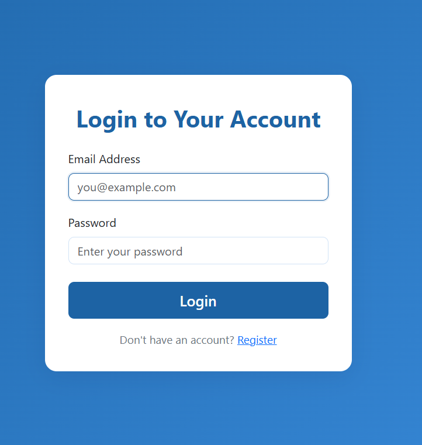
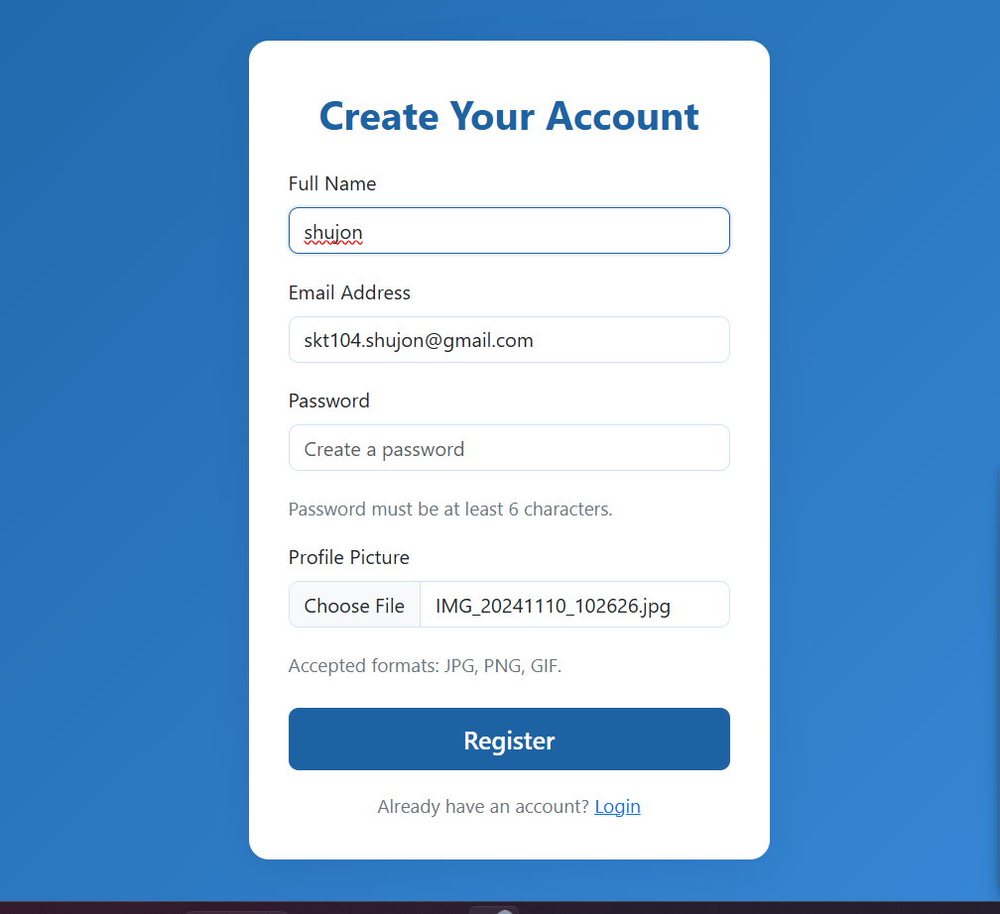
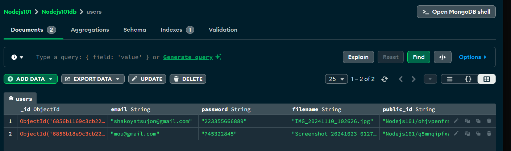
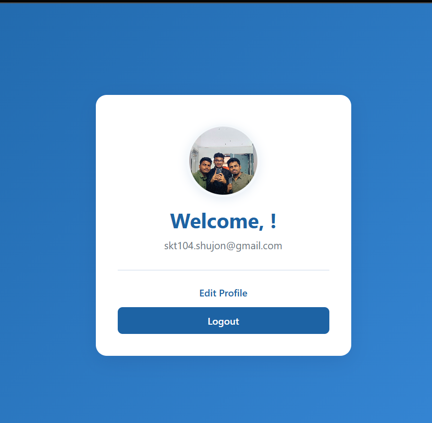

# RestApi Authentication with File Upload

<p align="center">
    
</p>

---

## 🚀 Overview

A RESTful API project featuring **JWT authentication** and **file upload**. This journey challenged my backend skills, deepened my understanding of secure authentication, and taught me how to handle files robustly in Node.js.

---

## 🌱 What I Learned & How I Overcame Challenges

| Challenge                  | What I Learned / How I Overcame It                                  |
|----------------------------|---------------------------------------------------------------------|
| **REST API Design**        | Planned clear, RESTful endpoints for CRUD operations.               |
| **Authentication**         | Implemented JWT; overcame token validation issues with middleware.  |
| **File Uploads**           | Managed `multipart/form-data` using Multer; handled edge cases for file types and storage. |
| **Error Handling**         | Built centralized error handlers for consistent, meaningful responses. |
| **Environment Variables**  | Secured sensitive data with `.env` and learned to avoid leaks.      |
| **Best Practices**         | Refactored code for modularity and scalability; followed industry standards. |

---

## 🗂️ Project Structure

```text
/RestApi-Authentication-with-FileUpload
│
├── controllers/
├── middleware/
├── models/
├── routes/
├── uploads/
├── .env
├── app.js
└── README.md
```

---

## 📸 Screenshots

| Feature                        | Screenshot                        |
|---------------------------------|-----------------------------------|
| **API Authentication**          |  |
| **File Upload & Registration**  |     |
| **MongoDB Data**                |    |
| **Login with Credentials**      |   |
| **Profile Verification**        |    |

---

## 🛠️ Getting Started

1. **Clone** the repository.
2. Run `npm install`.
3. Configure your `.env` file.
4. Start the server: `npm start`.

---

## 📝 Conclusion

This project was a hands-on deep dive into backend development. I learned to tackle real-world authentication and file handling challenges, improved my API security skills, and adopted best practices for scalable Node.js applications.

---
